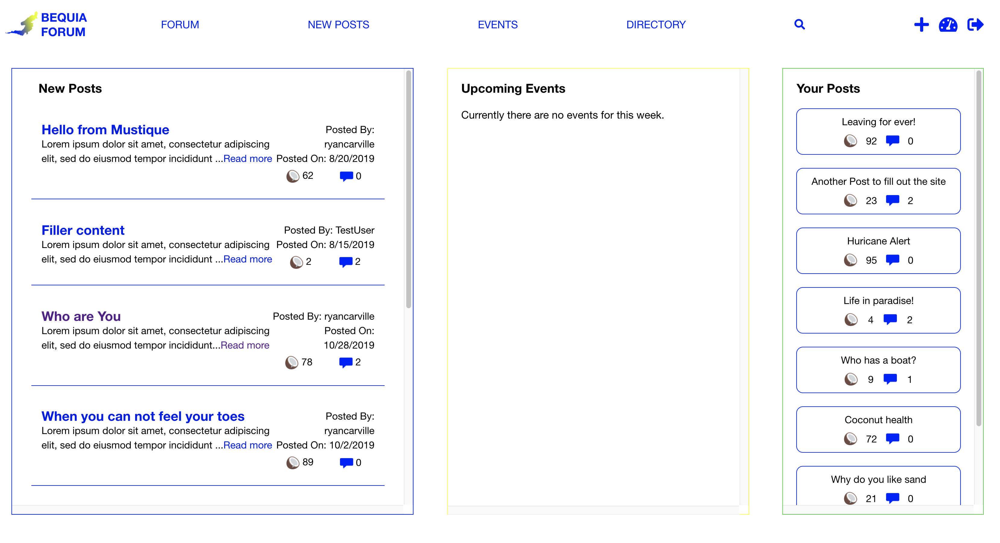
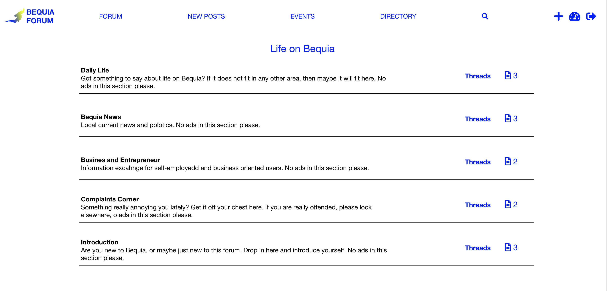
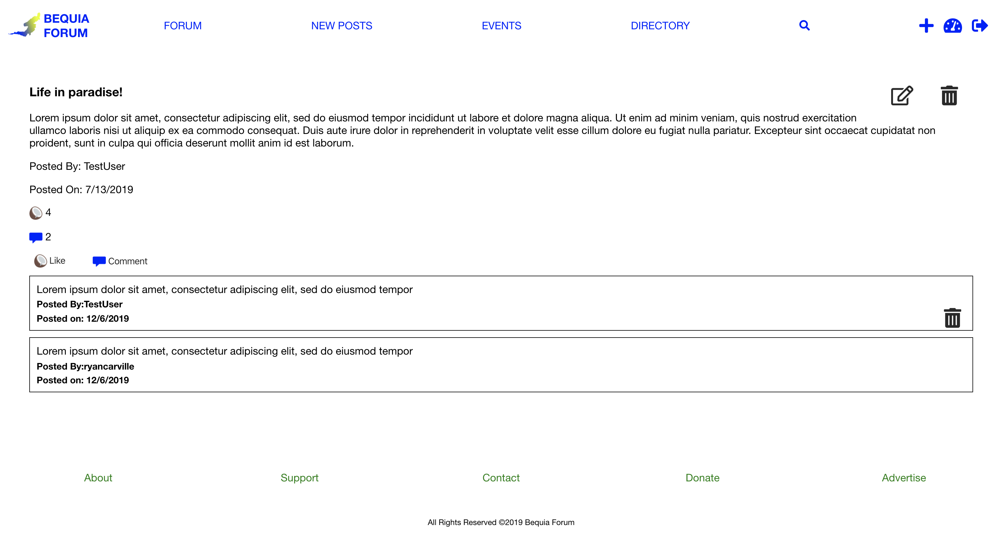
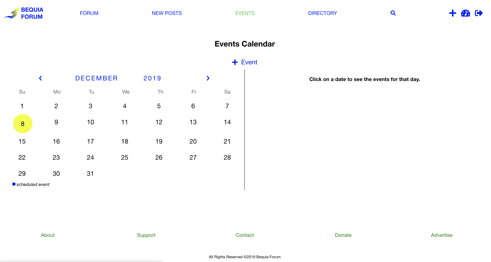

# Bequia Forum App

React App client that utilizes a custom API and modern technoliges. This client serves as a messageboard and market place for the island of Bequia.

## Technologies

React, JavaScript, Node.js, HTML5, CSS5

## Available Scripts

In the project directory, you can run:

### `npm start`

Runs the app in the development mode. 
Open [http://localhost:3000](http://localhost:3000) to view it in the browser.

The page will reload if you make edits. 
You will also see any lint errors in the console.

### `npm test`

Launches the test runner in the interactive watch mode. 
See the section about [running tests](https://facebook.github.io/create-react-app/docs/running-tests) for more information.

### `npm run deploy`

Builds the app for production to the `build` folder. 
It correctly bundles React in production mode and optimizes the build for the best performance.

The build is minified and the filenames include the hashes. 
Then it uses Now.sh to host the client.

## Screenshots

Landing Page

Logged in User Dashboard

Forum Section

Forum Post Page

Events Calendar

